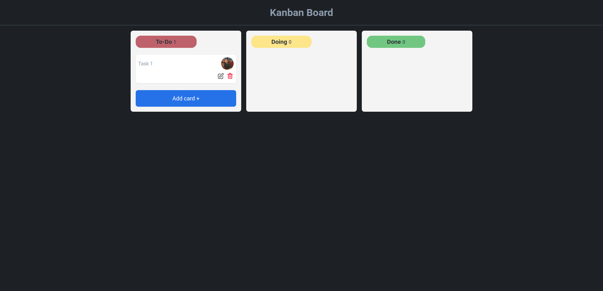

# Kanban Board

<h4 align="center">Web Application to manage tasks.</h4>

<p align="center">
  <a href="#how-to-use">How To Use</a> •
  <a href="#license">License</a>
</p>

<h1 align="center">
    
</h1>

### Full version of the Documentation: [Confluence](https://thalissoncastrog.atlassian.net/l/cp/yLNaEWbm)

## How To Use

To clone and run this application, you'll need [Git](https://git-scm.com) and [Node.js](https://nodejs.org/en/download/package-manager) installed on your computer.

After, from your command line:

```bash
# Clone this repository
$ git clone https://github.com/thalissoncastrog/kanban-board.git

# Go into the repository
$ cd kanban-board

# Install dependencies
$ npm install

# Run the app
$ npm run dev
```

> **Note**
> After run each command above, go to a web browser and access this url: http://localhost:[port].

## License

MIT

---

> Instagram [@thalissoncastrog](https://www.instagram.com/thalissoncastrog/) &nbsp;&middot;&nbsp;
> GitHub [@thalissoncastrog](https://github.com/thalissoncastrog) &nbsp;&middot;&nbsp;
> Email [thalisson.adao@gmail.com](mailto:thalisson.adao@gmail.com)
